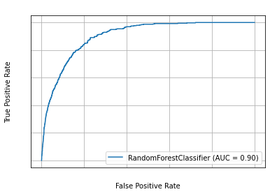

## Problem Definition

- predict the probability of default for each user id in risk modeling
- default = 1 means defaulted users, default = 0 means otherwise
- Imbalance binary classification problem

## Expected Workflow


## Variables (total = 43):

- uuid: text User Id <br>
- default: (or target) boolean (0, or 1) <br>
- Categorical, and numerical features are defined in `default_modeling.utils.preproc` (function `feature_definition`)

## Adjustment:
- If you want to run the experiment with your data for the purpose of binary classification:
    * Replace csv in both `train_data` and `test_data` by your csv. (**Optional**: also change test file `test_sample_1.csv` in `default_modeling/default_modeling/tests/data/` for unit test). Each row of your csv should correspond to unique User ID .
    * Redefine categorical, numerical features in `default_modeling/default_modeling/utils/preproc.py` (function `feature_definition`) based on your definition
    * Change `TARGET=default` in Dockerfile to `TARGET={your target variable}`
    * Data example can be seen below
<div>
<table border="1" class="dataframe">
  <thead>
    <tr style="text-align: left;">
      <th>UUID (User id)</th>
      <th>Feature 1</th>
      <th>...</th>
      <th>Feature N</th>
      <th>Target (binary)</th>
    </tr>
  </thead>
  <tbody>
    <tr>
      <th>001</th>
      <td>100</td>
      <td>...</td>
      <td>"AAA"</td>
      <td>0</td>
    </tr>
    <tr>
      <th>002</th>
      <td>300</td>
      <td>...</td>
      <td>"BBB"</td>
      <td>1</td>
    </tr>
  </tbody>
</table>
</div>

## Package Requirements:
- pandas, numpy, category_encoders, sklearn, scipy, joblib, Cython

## Folder Structure

    .
    ├── Dockerfile
    ├── default_modeling
    │   ├── __init__.py
    │   ├── default_modeling
    │   │   ├── __init__.py
    │   │   ├── interface
    │   │   │   ├── __init__.py
    │   │   │   ├── launch_predicting.py
    │   │   │   ├── launch_training.py
    │   │   │   ├── predict.py
    │   │   │   ├── predictor.c
    │   │   │   ├── predictor.pyx
    │   │   │   ├── train.py
    │   │   │   ├── trainer.c
    │   │   │   └── trainer.pyx
    │   │   └── utils
    │   │       ├── __init__.py
    │   │       ├── load.py
    │   │       └── preproc.py
    │   ├── setup.py
    │   ├── tests
    │   │   ├── __init__.py
    │   │   ├── data
    │   │   │   └── test_sample_1.csv
    │   │   ├── test_case_base.py
    │   │   └── test_data_handling.py
    ├── model
    │   └── risk_model.joblib
    ├── prototype
    │   ├── prototype_cython.ipynb
    │   └── prototype_python.ipynb
    ├── requirements.txt
    ├── test_data
    │   ├── test_set_1.csv
    │   └── test_set_2.csv
    └── train_data
        ├── train_set_1.csv
        └── train_set_2.csv


## DockerFile Contents

- My Local Working Directory named `/home/jupyter`. In this local working directory:
  * `train_data` folder contains different files for training random forest classifers
  * `model` folder store the trained `.joblib` random forest, and the model will be loaded in this folder for prediction
  * `test_data` folder contains new data coming and waiting for prediction, prediction result will be locally stored inside the same file in this folder.
- Container will mount to those local folders: `train_data`, `test_data` and `model`
- With this approach, we can conveniently play with every new data coming, by replacing the files inside `train_data` and/or `test_data`
- Container is built both in pure Python and Cython
```python
FROM python:3.8
WORKDIR /app/

RUN mkdir model

ENV TRAIN_FOLDER=./train_data
ENV TEST_FOLDER=./test_data
ENV TRAIN_FILE=train_set.csv
ENV TEST_FILE=test_set.csv
ENV MODEL_DIR=./model
ENV MODEL_NAME=risk_model
ENV TARGET=default

COPY requirements.txt .

RUN pip install -r requirements.txt
COPY default_modeling default_modeling
RUN python3 -m default_modeling.setup build_ext --inplace

ENTRYPOINT ["python3"]
```
## Build Image from Dockerfile


```python
!docker build -t default_model -f Dockerfile .
```


## First, run unit test in Image to make sure everything's OK


```python
!docker run -t default_model:latest -m unittest discover default_modeling
```
    Found the following test data
    default_modeling/tests/data/test_sample_1.csv
    ..
    ----------------------------------------------------------------------
    Ran 2 tests in 0.772s
    
    OK


## Train with the first file `TRAIN_SET_1.csv` to obtain the first model. Remember to mount to local `train_data`, and `model`


```python
!docker run -v /home/jupyter/train_data:/app/train_data \
            -v /home/jupyter/model:/app/model default_model:latest \
            -m default_modeling.default_modeling.interface.train \
            --train-file train_set_1.csv
```
### or Run with Cython module (called with interface `launch_training.py`)
```python
!docker run -v /home/jupyter/train_data:/app/train_data \
            -v /home/jupyter/model:/app/model default_model:latest \
            -m default_modeling.default_modeling.interface.launch_training \
            --train-file train_set_1.csv
```

    extracting arguments
    Namespace(max_depth=10, min_samples_leaf=10, model_dir='./model', model_name='risk_model', n_estimators=100, random_state=1234, target='default', train_file='train_set_1.csv', train_folder='./train_data')
    Training Data at ./train_data/train_set_1.csv
    Total Input Features 39
    class weight {0: 0.5071993428787708, 1: 35.22539149888143}
    Congratulation! Saving model at ./model/risk_model.joblib. Finish after 5.14886212348938 s

### It's reported running Cython takes only 4.3 s in training, which is 15% faster.

## Now if we replace by a new training file (continuous training): TRAIN_SET_2.csv (the previous joblib model will be overwritten).


```python
!docker run -v /home/jupyter/train_data:/app/train_data \
            -v /home/jupyter/model:/app/model \
            default_model:latest -m default_modeling.default_modeling.interface.train \
            --train-file train_set_2.csv
```

    extracting arguments
    Namespace(max_depth=10, min_samples_leaf=10, model_dir='./model', model_name='risk_model', n_estimators=100, random_state=1234, target='default', train_file='train_set_2.csv', train_folder='./train_data')
    Training Data at ./train_data/train_set_2.csv
    Total Input Features 39
    class weight {0: 0.5074062934696794, 1: 34.255076142131976}
    Found existing model at: ./model/risk_model.joblib.
    Overwriting ...
    Congratulation! Saving model at ./model/risk_model.joblib. Finish after 2.718583345413208 s


## Now if we would like to tune or modify random forest hyperparameters.


```python
!docker run -v /home/jupyter/train_data:/app/train_data \
            -v /home/jupyter/model:/app/model \
            default_model:latest -m default_modeling.default_modeling.interface.train \
            --train-file train_set_2.csv \
            --n-estimators 200 \
            --max-depth 15 \
            --min-samples-leaf 20
```

    extracting arguments
    Namespace(max_depth=15, min_samples_leaf=20, model_dir='./model', model_name='risk_model', n_estimators=200, random_state=1234, target='default', train_file='train_set_2.csv', train_folder='./train_data')
    Training Data at ./train_data/train_set_2.csv
    Total Input Features 39
    class weight {0: 0.5074062934696794, 1: 34.255076142131976}
    Found existing model at: ./model/risk_model.joblib.
    Overwriting ...
    Congratulation! Saving model at ./model/risk_model.joblib. Finish after 3.4293792247772217 s


## Use image to predict new data 1 `test_set_1.csv`. Now, mount to local `test_data`, and `model`


```python
!docker run -v /home/jupyter/test_data:/app/test_data  \
            -v /home/jupyter/model:/app/model default_model:latest \
            -m default_modeling.default_modeling.interface.predict \
            --test-file test_set_1.csv         
```
### Or Run Cython module with interface `launch_predicting.py`

```python
!docker run -v /home/jupyter/test_data:/app/test_data \
            -v /home/jupyter/model:/app/model default_model:latest \
            -m default_modeling.default_modeling.interface.launch_predicting \
            --test-file test_set_1.csv
```

    extracting arguments
    Namespace(model_dir='./model', model_name='risk_model', target='default', test_file='test_set_1.csv', test_folder='./test_data')
    Found model at: ./model/risk_model.joblib
    Predicting test_set_1.csv ....
    Finish after 0.5522034168243408 s
    ...to csv ./test_data/test_set_1.csv

### Running Cython takes only 0.4 s in prediction, which is 20% faster.
## Use image to predict new data 2 `test_set_2.csv`.


```python
!docker run -v /home/jupyter/test_data:/app/test_data  \
            -v /home/jupyter/model:/app/model default_model:latest \
            -m default_modeling.default_modeling.interface.predict \
            --test-file test_set_2.csv                                                 
```

    extracting arguments
    Namespace(model_dir='./model', model_name='risk_model', target='default', test_file='test_set_2.csv', test_folder='./test_data')
    Found model at: ./model/risk_model.joblib
    Predicting test_set_2.csv ....
    Finish after 0.3289515972137451 s
    ...to csv ./test_data/test_set_2.csv

## In general, Cythonizing the modules could fasten the process 15 - 20%, compared with pure Python modules

## We have prediction in local folder test_data. Evaluate with Metrics

- Decision threshold on the probability of default would probably depend on credit policy. There could be several cutoff points or a mathematical cost function rather than a fixed decision threshold. Therefore, binary metrics like F1, Recall, or Precision is not meaningful in this situation. And the output should be a prediction in probability.
- KS-statistic (between P(prediction|truth = 1) and P(prediction|truth = 0) to quantify the distance between 2 classes) are used to evaluate model.
- Left plot: ROC AUC Curve
- Right plot: Normalized KS Distribution of 2 types of users:
  * class 0: non-default
  * class 1: default

 

## Conclusions & Future Work

- With KS score = 0.66 and small p-value, this means the predictor can properly distinguish between default and non-default users (test is significant)
- Visually, we can observe the clear gap in the KS distribution plot between 2 classes
- In the future, host with AWS Sagemeker endpoint
