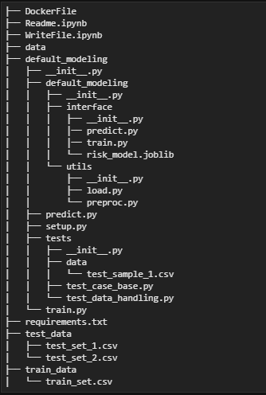

## Problem Definition

- predict the probability of default for each user id in risk modeling
- default = 1 means defaulted users, default = 0 means otherwise
- Imbalance binary classification problem

## Expected Workflow


## Variables (total = 43):

- uuid: text User Id <br>
- default: (or target) boolean (0, or 1) <br>
- Categorical, and numerical features are defined in default_modeling.utils.preproc (function feature_definition)

## Package Requirements:
- pandas, numpy, category_encoders, sklearn, scipy, joblib

## Folder Structure



## DockerFile Contents

- My Local Working Directory named `/home/jupyter`
- `train_data` folder are copied inside container to train and save a random forest .joblib model
- New csv data are stored inside this `test_data` folder
- Container will mount to this `test_data` folder
- And prediction result will be locally stored
FROM python:3.8
RUN pwd
RUN dir
ADD requirements.txt .
RUN pip install -r requirements.txt
ENV TRAINING_FOLDER=./train_data
ENV TESTING_FOLDER=./test_data
ENV MODEL_DIR=./default_modeling/default_modeling/interface/
ENV MODEL_NAME=risk_model.joblib

ADD default_modeling default_modeling
ADD train_data train_data

RUN dir
RUN python3 -m default_modeling.train --datafolder ${TRAINING_FOLDER} \
                                      --model-dir ${MODEL_DIR} \
                                      --model-name ${MODEL_NAME}
ENTRYPOINT ["python3", "-m"]
## Build Image from DockerFile


```python
!docker build -t default_model -f DockerFile .
```

    Sending build context to Docker daemon  66.04MB
    Step 1/14 : FROM python:3.8
     ---> 79372a158581
    Step 2/14 : RUN pwd
     ---> Using cache
     ---> a1eb9c6ecf40
    Step 3/14 : RUN dir
     ---> Using cache
     ---> 86f013f58573
    Step 4/14 : ADD requirements.txt .
     ---> Using cache
     ---> 802ce470a44d
    Step 5/14 : RUN pip install -r requirements.txt
     ---> Using cache
     ---> f48df72b81f6
    Step 6/14 : ENV TRAINING_FOLDER=./train_data
     ---> Using cache
     ---> ed426028a565
    Step 7/14 : ENV TESTING_FOLDER=./test_data
     ---> Using cache
     ---> cf87e3385b35
    Step 8/14 : ENV MODEL_DIR=./default_modeling/default_modeling/interface/
     ---> Using cache
     ---> 5ae07b8e658e
    Step 9/14 : ENV MODEL_NAME=risk_model.joblib
     ---> Using cache
     ---> 1a59dc9dd9ca
    Step 10/14 : ADD default_modeling default_modeling
     ---> Using cache
     ---> 026b4ed8ea6b
    Step 11/14 : ADD train_data train_data
     ---> Using cache
     ---> 6101affba3d0
    Step 12/14 : RUN dir
     ---> Using cache
     ---> 2703567123b9
    Step 13/14 : RUN python3 -m default_modeling.train --datafolder ${TRAINING_FOLDER}                                       --model-dir ${MODEL_DIR}                                       --model-name ${MODEL_NAME}
     ---> Using cache
     ---> da625c2a3508
    Step 14/14 : ENTRYPOINT ["python3", "-m"]
     ---> Using cache
     ---> 56a8f4ca5660
    Successfully built 56a8f4ca5660
    Successfully tagged default_model:latest


## Run Unit Test in Image


```python
!docker run -t default_model:latest  unittest discover default_modeling
```

    folder view
    [PosixPath('bin'), PosixPath('sys'), PosixPath('dev'), PosixPath('var'), PosixPath('mnt'), PosixPath('opt'), PosixPath('proc'), PosixPath('boot'), PosixPath('usr'), PosixPath('lib'), PosixPath('media'), PosixPath('etc'), PosixPath('sbin'), PosixPath('root'), PosixPath('lib64'), PosixPath('srv'), PosixPath('run'), PosixPath('tmp'), PosixPath('home'), PosixPath('default_modeling'), PosixPath('train_data')]
    Found the following test data
    default_modeling/tests/data/test_sample_1.csv
    ..
    ----------------------------------------------------------------------
    Ran 2 tests in 0.772s
    
    OK


## USE IMAGE TO PREDICT NEW DATA 1


```python
!docker run -v /home/jupyter/test_data:/test_data \
              default_model:latest default_modeling.predict \
              --test-file test_set_1.csv
```

    extracting arguments
    Model path: ./default_modeling/default_modeling/interface/risk_model.joblib
    Predicting test_set_1.csv ....
    Finish after 0.4429047107696533 s
    ...to csv ./test_data/test_set_1.csv

## USE IMAGE TO PREDICT NEW DATA 2

```python
!docker run -v /home/jupyter/test_data:/test_data \
              default_model:latest default_modeling.predict \
              --test-file test_set_2.csv
```

    extracting arguments
    Model path: ./default_modeling/default_modeling/interface/risk_model.joblib
    Predicting test_set_2.csv ....
    Finish after 0.23941326141357422 s
    ...to csv ./test_data/test_set_2.csv


## We have prediction in local folder test_data. Evaluate with Metrics

- Decision threshold on the probability of default would probably depend on credit policy. There could be several cutoff points or a mathematical cost function rather than a fixed decision threshold. Therefore, binary metrics like F1, Recall, or Precision is not meaningful in this situation. And the output should be a prediction in probability.
- KS-statistic (between P(prediction|truth = 1) and P(prediction|truth = 0) to quantify the distance between 2 classes) are used to evaluate model.
- Left plot: ROC AUC Curve
- Right plot: Normalized KS Distribution of 2 types of users:
  * class 0: non-default
  * class 1: default

 

## Conclusions & Future Work

- With KS score = 0.66 and small p-value, this means the predictor can properly distinguish between default and non-default users (test is significant)
- Visually, we can observe the clear gap in the KS distribution plot between 2 classes
- In the future, host with AWS Sagemeker endpoint
